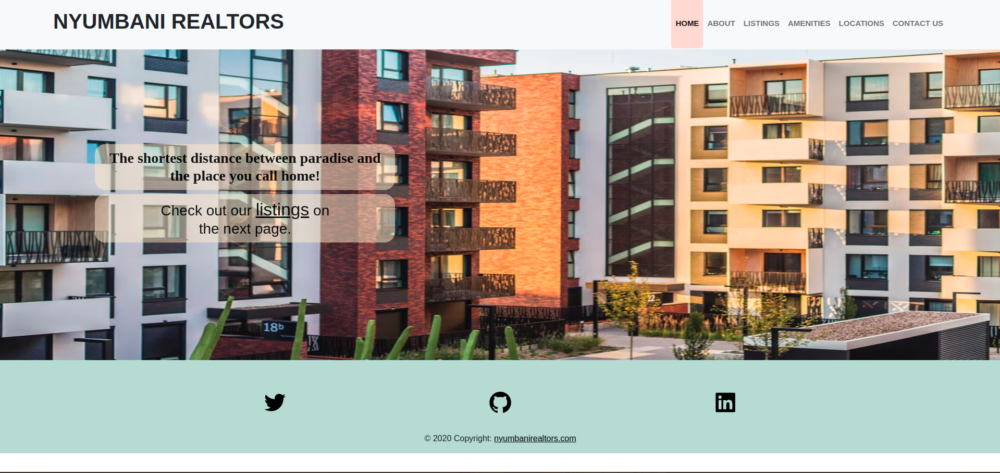

# NYUMBANI REALTORS 

##### By Kelly Kiiru  Sylvia Chepkoech  Agness Mbiti  Elsie Akoth  Lydiah Wachira  Sarah Kamunya  Christine Nkatha 

+ [Description](#description)
+ [Technology Used](#technology-used)
+ [Reference](#reference)
+ [Licence](#licence)
+ [Authors Info](#author-Info)

## Description

A website for Nyumbani Realtors, a real estate company, containing properties listed for either sale or rent and the facilities provided, their locations and the contact information.

## Setup/Installation Requirements

* Fork and then clone this repository into an empty folder in your computer.
* To make changes to the programme, open it in a text editor of your choice.
* Alternatively, to only view the file, click on this live link :

## Requirements

To be able to run this web application, you will need to have a web browser, preferably Google Chrome or chromium. Just open the url link deployed on GitHub and run it.

## Technology Used

*HTML - To build the structure of the pages
*CSS - To style the Pages
*JavaScript - To make the pages more dynamic.
*jQuery -To add efects to the pages.

## Known Bugs

There are no known bugs in the project.

## Support and contact details

For any inquiries or comments, contact us at

Email: lydiahcedric@gmail.com
telephone: +2546789101112

### License
MIT License

Copyright (c) 2022 lydiah wachira

Permission is hereby granted, free of charge, to any person obtaining a copy
of this software and associated documentation files (the "Software"), to deal
in the Software without restriction, including without limitation the rights
to use, copy, modify, merge, publish, distribute, sublicense, and/or sell
copies of the Software, and to permit persons to whom the Software is
furnished to do so, subject to the following conditions:

The above copyright notice and this permission notice shall be included in all
copies or substantial portions of the Software.

THE SOFTWARE IS PROVIDED "AS IS", WITHOUT WARRANTY OF ANY KIND, EXPRESS OR
IMPLIED, INCLUDING BUT NOT LIMITED TO THE WARRANTIES OF MERCHANTABILITY,
FITNESS FOR A PARTICULAR PURPOSE AND NONINFRINGEMENT. IN NO EVENT SHALL THE
AUTHORS OR COPYRIGHT HOLDERS BE LIABLE FOR ANY CLAIM, DAMAGES OR OTHER
LIABILITY, WHETHER IN AN ACTION OF CONTRACT, TORT OR OTHERWISE, ARISING FROM,
OUT OF OR IN CONNECTION WITH THE SOFTWARE OR THE USE OR OTHER DEALINGS IN THE
SOFTWARE.

## Authors Info

Slack Profile - [Kelly Kiiru](https://app.slack.com/client/T0101L740P4/D02U92P50AV/user_profile/U02TWD8AEDQ)

Linked - [Kelly Kiiru](https://www.linkedin.com/in/kiiru-ryan-15a852231/)
